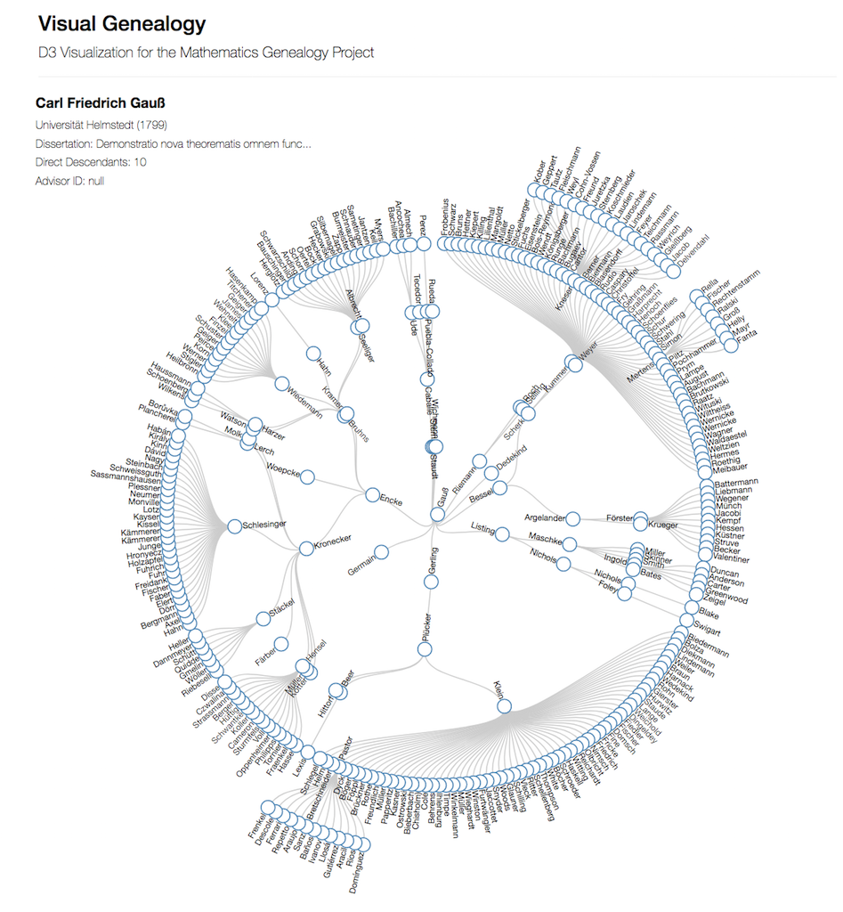

# Visual Genealogy

Tree visualization for the [Mathematics Genealogy Project](https://www.genealogy.math.ndsu.nodak.edu) built with `d3.js`.

I obtained the genealogy data from the NDSU site by using `requests` and `beautifulsoup`. 

The records are stored in MongoDB on [mlab](mlab.com).

